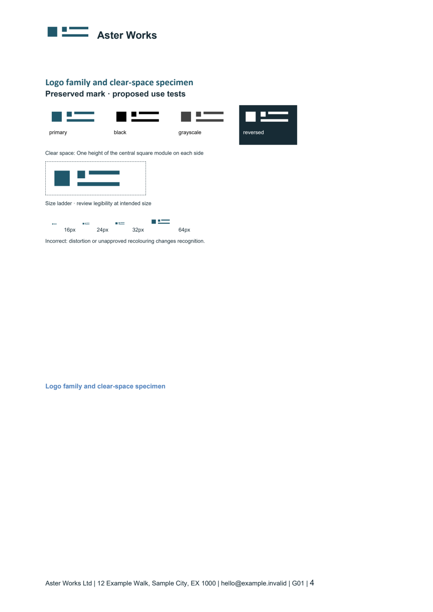

# Brand Suite

Turn evidence from an existing codebase into a coherent brand catalogue and corporate document package: 36 coordinated slots in HTML, editable DOCX and locally rendered PDF, with email stationery, ordinary stamps, provenance and release controls.



All demonstrations are fictional. Documents are unexecuted drafts; technical QA never grants legal approval, verifies incorporation or authorizes publication of a user's business material.

## Install

```sh
npx skills add sammadijaz/brand-suite --skill brand-suite --agent codex
```

Use `--agent claude-code` for that agent. Installation is project-scoped by default. Review the skill before installing. The separate Vercel installer documents `DISABLE_TELEMETRY=1` (or `DO_NOT_TRACK=1`) to opt out of its telemetry; this skill itself has none. Installation does not install Python, fonts, Word, LibreOffice or a browser. See [installation](docs/INSTALLATION.md).

## Use

Ask your coding agent: “Use $brand-suite to create a corporate document suite from this repository. Keep the codebase read-only, use our approved assets, and place drafts in a separate output directory.” The agent investigates sources and chooses drafting terms; helpers provide repeatable assembly and checks.

To exercise the synthetic fixture as a maintainer:

```sh
npm ci --ignore-scripts
npm --prefix skills/brand-suite ci --ignore-scripts
python -m venv .work/venv
# Activate that environment, then:
python -m pip install -r skills/brand-suite/requirements.txt
npm run fixtures
node skills/brand-suite/scripts/brand-suite.mjs doctor
node skills/brand-suite/scripts/brand-suite.mjs build --input tests/fixtures/full.json --target tests/fixtures/codebase --out .work/aster-suite
node skills/brand-suite/scripts/brand-suite.mjs qa --out .work/aster-suite
node skills/brand-suite/scripts/brand-suite.mjs package --out .work/aster-suite --zip .work/aster-suite.zip
```

Set `BRAND_SUITE_PYTHON` to the environment executable if it is not on PATH. Windows uses installed Word and Chrome; Linux/macOS require a local LibreOffice/browser configuration. No external model key or paid rendering service is required. [Quickstart](docs/QUICKSTART.md) covers installed use and dependency setup.

## Inventory

| Family | Slots | Coverage |
|---|---:|---|
| Guides | G00–G02 | Start/release, illustrated catalogue, source/site review |
| Stationery | S01–S07 | Colour/monochrome/continuation masters, letter, email, signature, stamps |
| People | P01–P07 | Offer, employment, onboarding, contractor, IP, verification, offboarding |
| Agreements | A01–A08 | Mutual/one-way NDA, MSA, SOW, amendment, execution, DPA, MOU |
| Corporate | C01–C08 | Conditional governance/authority, KYB, submission, certified-copy draft, notice, release register |
| Finance | F01–F03 | Commercial invoice, payment receipt, dispute evidence |

Full-suite retains 36 slots and 108 baseline artifacts. Inapplicable slots become clearly labelled three-format notes, counted separately from instruments. Conditional titles follow the real entity. Email SEND/CID/plain-text files, outlined SVG/exact-mm PDF/600dpi transparent stamps, assets, evidence controls, manifest, previews, offline index and ZIP are supplementary. See the [catalogue](docs/DOCUMENT_CATALOGUE.md).

Modes: `full-suite`, `audit-only`, `stationery-only`, `update-existing`, `validate-existing`. Partial modes are labelled. Existing signed or manually edited masters are preserved; updates use new version directories. Automatic negotiated-Word round-trip import is unsupported.

## Architecture and validation

The self-contained installed folder carries ESM Node orchestration, JSON schemas, semantic drafting blocks, Python native DOCX/asset/PDF helpers and read-only release checkers. Word-derived PDF is the primary print artifact; Chromium print is independently tested. No compiled-source drift, database, server, Docker requirement or mandatory external API exists.

See [actual validation](docs/VALIDATION.md) for executed tests and [acceptance matrix](docs/ACCEPTANCE_MATRIX.md) for requirement evidence. Installation recognition and host-agent execution are distinct. English/A4 and English/Letter are the declared fixture scope; RTL/non-Latin production is blocked when unsupported, and client/physical/legal tests remain separate. No claim is made for every Word version or email client.

## Privacy and legal scope

Target codebases are read-only. Secret/private locations are excluded by default. Renderers receive generated, escaped passive content; browser network access is denied and its sandbox stays enabled. Public examples contain only synthetic fields. The helper never sends email, inserts signatures, certifies copies, orders stamps or publishes business outputs.

Use current applicable official sources and authorized local reviewers for material legal, tax, employment, governance and transfer questions. Unresolved facts/terms remain visible; human approval is separate from technical results. Read [privacy](docs/PRIVACY.md), [legal scope](docs/LEGAL_SCOPE.md) and [troubleshooting](docs/TROUBLESHOOTING.md).

Original code/instructions are MIT licensed. Users retain applicable rights to their inputs; third-party trademarks, artwork and fonts are not relicensed. [Third-party notices](THIRD_PARTY_NOTICES.md) records research and dependency boundaries. Contributions: [CONTRIBUTING.md](CONTRIBUTING.md). Security reports: [SECURITY.md](SECURITY.md).
